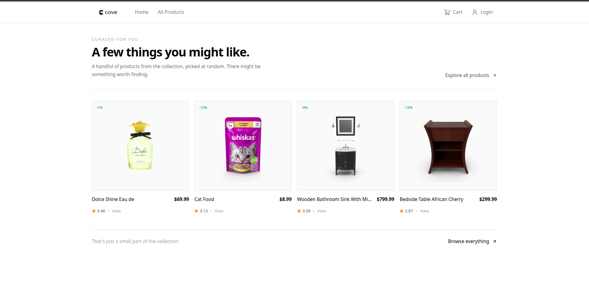

<div align="center">

# Cove

**A modern, minimal e-commerce storefront built with React**

[](https://cove-seven-snowy.vercel.app/)
[](https://react.dev)
[](https://vite.dev)
[](https://tailwindcss.com)

[Live Site](https://cove-seven-snowy.vercel.app/) · [Report Bug](https://github.com/Bodhisattva-Duduka/Cove-E-Commerce-app/issues) · [Request Feature](https://github.com/Bodhisattva-Duduka/Cove-E-Commerce-app/issues)

</div>

---

## Live Link: https://cove-seven-snowy.vercel.app/


## About

**Cove** is a clean, fully responsive e-commerce web application with a sharp editorial design aesthetic. It fetches real product data from the [DummyJSON API](https://dummyjson.com/) and provides a complete shopping experience — from browsing and searching products, to managing a cart, placing orders, and handling user accounts — all without a backend.

---

## Features

| Area | Details |
|---|---|
| **Home** | Curated product suggestions that auto-rotate every 3 seconds |
| **Product Catalog** | Paginated grid with **search** (debounced) and **sort** (price, title, asc/desc) via URL search params |
| **Category Browsing** | Dynamic category bar fetched from the API; category-filtered product listings |
| **Product Details** | Full product page with images, description, price, rating, and stock info |
| **Shopping Cart** | Add / remove items, adjust quantities, live order summary with totals |
| **Checkout** | Cart checkout and "Buy Now" single-item checkout flows |
| **Authentication** | Client-side sign-up & login with form validation and protected routes |
| **Account Management** | View & edit profile details; view order history |
| **Responsive Design** | Fully responsive across mobile, tablet, and desktop breakpoints |

---

## Tech Stack

| Layer | Technology |
|---|---|
| **Framework** | [React 19](https://react.dev) |
| **Build Tool** | [Vite 8](https://vite.dev) |
| **Styling** | [Tailwind CSS 4](https://tailwindcss.com) |
| **Routing** | [React Router v7](https://reactrouter.com) |
| **Icons** | [Lucide React](https://lucide.dev) |
| **API** | [DummyJSON](https://dummyjson.com) |
| **Deployment** | [Vercel](https://vercel.com) |

---

## Architecture

```
src/
├── assets/              # Static assets (logo, banner images)
├── components/
│   ├── Account/
│   │   ├── Account.jsx         # Account layout with nested routes
│   │   ├── AccountDetails.jsx  # Edit profile information
│   │   └── OrderDetails.jsx    # Order history view
│   ├── Products/
│   │   ├── Products.jsx        # Product listing with search, sort & pagination
│   │   ├── ProductItem.jsx     # Single product detail page
│   │   ├── ProductBox.jsx      # Product card component
│   │   └── ProductsPage.jsx    # Layout wrapper with Outlet
│   ├── Cart.jsx                # Shopping cart with quantity controls
│   ├── Categories.jsx          # Category-filtered product grid
│   ├── CategoryBar.jsx         # Horizontal category navigation
│   ├── Checkout.jsx            # Order confirmation page
│   ├── Home.jsx                # Landing page with rotating suggestions
│   ├── Login.jsx               # Sign-up & login forms
│   ├── Navbar.jsx              # Sticky header with cart badge
│   └── ProtectedRoute.jsx      # Auth guard for account routes
├── context/
│   ├── CartContext.js          # Cart & orders state
│   └── UserContext.js          # User auth & profile state
├── hooks/
│   ├── useFetch.js             # Data fetching with abort controller
│   └── useDebounce.js          # Debounced search input
├── App.jsx                     # Route definitions & context providers
├── main.jsx                    # Entry point
└── index.css                   # Global styles
```

---

## UI



---

## Getting Started

### Prerequisites

- **Node.js** ≥ 18
- **npm** ≥ 9

### Installation

```bash
# Clone the repository
git clone https://github.com/Bodhisattva-Duduka/Cove-E-Commerce-app.git
cd Cove-E-Commerce-app

# Install dependencies
npm install

# Start the development server
npm run dev
```

The app will be available at `http://localhost:5173`.

### Build for Production

```bash
npm run build
npm run preview
```


---

<div align="center">

**Built with ☕ by [Bodhisattva Duduka](https://github.com/Bodhisattva-Duduka)**

</div>
